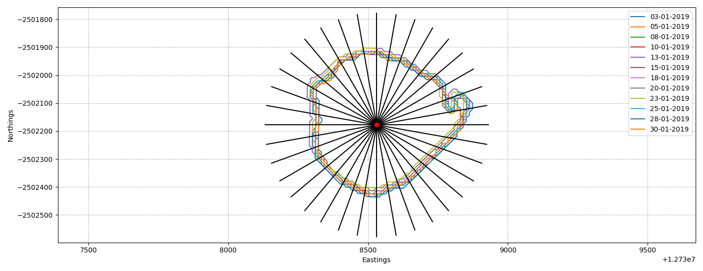
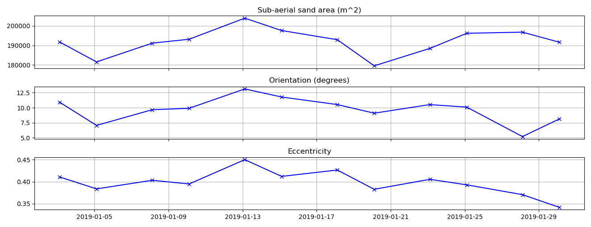

# CoastSat.islands

Satellite-derived shorelines and 2D planform measurements for islands, extension of the [CoastSat toolbox](https://github.com/kvos/CoastSat).

This toolkit enables users to measure shoreline position and two-dimensional planform characteristics (area and orientation) for small sandy islands.

Detailed methodology and application are described in: *Cuttler MVW, Vos K, Branson P, Hansen JE, O'Leary M, Browne NK, Lowe RJ (2020) Interannual response of reef islands to climate-driven variations in water level and wave climate. Remote Sensing, 12(24), 4089*

 It has the following functionalities:
- Download and preprocess Landsat and Sentinel-2 satellites images from Google Earth Engine (as in CoastSat)
- Map the island contours as polygons (more accurate than the shoreline detection in CoastSat for small islands)

- Automatically generate a set of cross-shore transects around the islands

- Compute planform island metrics such as area, orientation and eccentricity

- Tidally-correct time-series of shoreline change along the transects as well as the entire island polygons

### Installation
To run this toolkit you will need to have the `coastsat` environment installed (instructions in the main [CoastSat toolbox](https://github.com/kvos/CoastSat)).

### Usage
The [Jupyter Notebook](https://github.com/mcuttler/CoastSat.islands/blob/master/example_island_Eva_Island.ipynb) in the repository shows an example of satellite-derived shorelines and island area estimation at Eva Island, Western Australia. There is also a [Python script](https://github.com/mcuttler/CoastSat.islands/blob/master/example_islands.py) for users who prefer to use Spyder/PyCharm.

For the tidal correction, you will need time-series of water/tide levels at your site and an estimate of the beach-face slope. You can provide the tide levels in a .txt file as shown in the /example folder. Otherwise, you can use a global tide model to get the modeled tide levels. To use [FES2014](https://www.aviso.altimetry.fr/es/data/products/auxiliary-products/global-tide-fes/description-fes2014.html) global tide model to get the tide levels at the time of image acquisition, refer to the [CoastSat.slope](https://github.com/kvos/CoastSat.slope) repository and follow the [instructions](https://github.com/kvos/CoastSat.slope/blob/master/doc/FES2014_installation.md) provided to setup the tide model. If you don't have an estimate of the beach-face slope you can also obtain one using [CoastSat.slope](https://github.com/kvos/CoastSat.slope).

### Issues
Having a problem? Post an issue in the [Issues page](https://github.com/mcuttler/CoastSat.islands/issues) (please do not email).

**If you like the repo put a star on it!**
